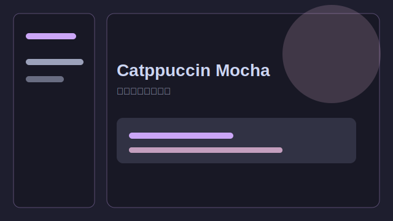
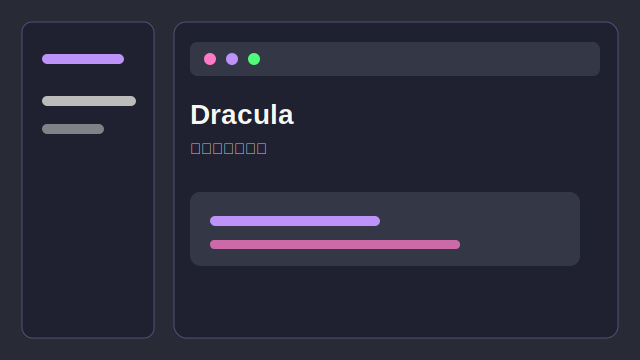
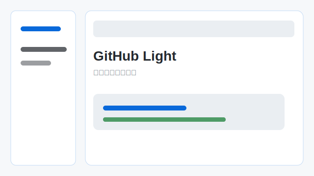
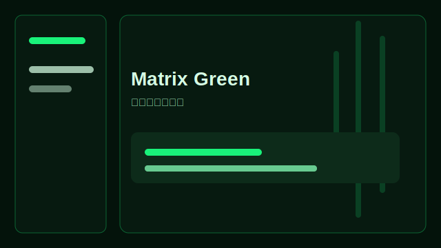
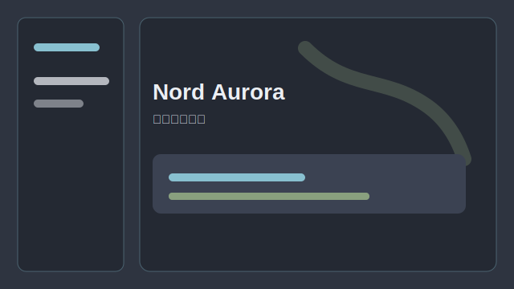
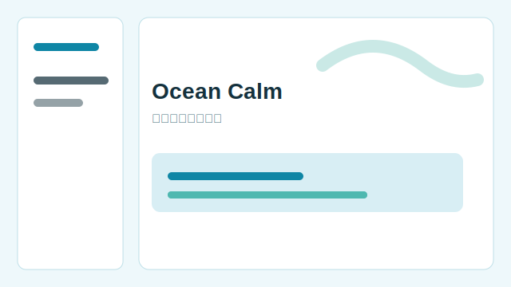
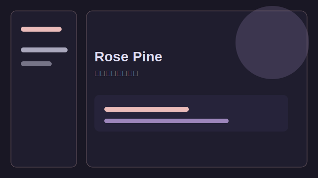
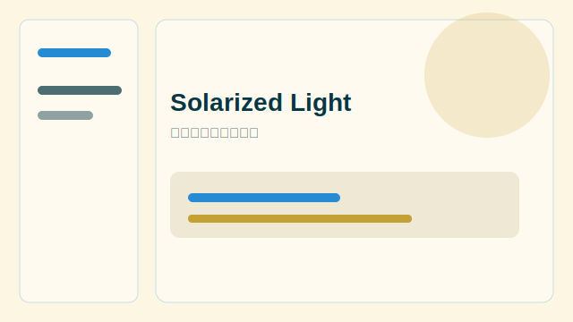
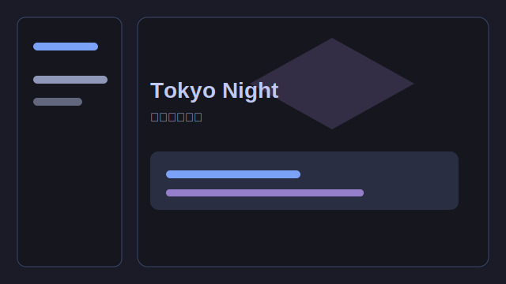

# Codex Skin

[简体中文](README.md)

Codex Skin is a Codex Skill with a Codex Plugin manifest for applying, switching, and building custom skins for the official Codex desktop app on macOS and Windows.

It uses a local Chromium DevTools Protocol connection to decorate the renderer. It does not patch the app bundle, replace the official executable, or modify `app.asar`.

This repository is released under Apache-2.0. Keep the license and notice files when redistributing.

## What It Does

- Apply one of the bundled skins to Codex and switch between themes.
- Create a new skin from a visual brief or local reference image.
- Export a portable `.codex-theme` package.
- Verify the active skin and capture a screenshot.
- Remove the live skin and restore the native Codex appearance.

Bundled skins:

- `catppuccin-mocha`
- `dilraba-rose`
- `dracula`
- `dream`
- `github-light`
- `kun-stage`
- `matrix-green`
- `nord-aurora`
- `ocean-calm`
- `rose-pine`
- `solarized-light`
- `tokyo-night`

The catalog is based on common editor, terminal, and GitHub theme directions. The CSS and preview images in this repository are original project assets and do not include third-party logos, screenshots, or brand artwork.

## Theme Gallery

| Theme | Preview |
| --- | --- |
| `catppuccin-mocha` |  |
| `dilraba-rose` |  |
| `dracula` |  |
| `dream` |  |
| `github-light` |  |
| `kun-stage` |  |
| `matrix-green` |  |
| `nord-aurora` |  |
| `ocean-calm` |  |
| `rose-pine` |  |
| `solarized-light` |  |
| `tokyo-night` |  |

## Requirements

- Official Codex desktop app
- macOS 12+ or Windows 10/11
- Node.js 20+
- A local CDP port bound to `127.0.0.1`

## Install As A Skill

For local use, copy this folder into your Codex skills directory:

```bash
mkdir -p ~/.codex/skills
cp -R /path/to/codex-skin ~/.codex/skills/codex-skin
```

Then ask Codex:

```text
Use $codex-skin to apply the dream skin to Codex.
```

## Publish As A Plugin

The repository root contains `.codex-plugin/plugin.json`. When the repository is added to a plugin marketplace or indexed by one, the manifest exposes this folder as the `codex-skin` Skill.

For local development, validate the plugin manifest with:

```bash
python3 /Users/mobvista/.codex/skills/.system/plugin-creator/scripts/validate_plugin.py /path/to/codex-skin
```

## Use A Skin

The easiest path is to run `setup-skin` once. It installs the skin settings and creates launch, restart, and restore entries on the desktop.

macOS:

```bash
cd /path/to/codex-skin
scripts/setup-skin.sh --theme dream
```

Windows:

```powershell
cd C:\path\to\codex-skin
scripts\setup-skin.ps1 -Theme dream
```

After setup, the desktop contains:

- `Codex Skin.command`: launch Codex with the selected skin.
- `Codex Skin - Restart.command`: close the current Codex window and reopen it with the skin.
- `Codex Skin - Restore.command`: remove the active skin.

If Codex is already running, save your current work and use the restart launcher. You can also run it from the terminal:

```bash
scripts/restart-skin.sh --theme dream
```

To switch skins, change the theme name:

```bash
scripts/install-skin.sh --theme kun-stage
scripts/restart-skin.sh --theme kun-stage
```

Bundled theme names:

- `catppuccin-mocha`
- `dilraba-rose`
- `dracula`
- `dream`
- `github-light`
- `kun-stage`
- `matrix-green`
- `nord-aurora`
- `ocean-calm`
- `rose-pine`
- `solarized-light`
- `tokyo-night`

## Remove A Skin

To remove only the live injected skin:

```bash
scripts/restore-skin.sh
```

This stops the skin injector and removes the decorative layer when Codex is reachable. It does not delete Codex threads, tasks, credentials, or user data.

To remove generated desktop shortcuts and restore the saved base-theme settings:

```bash
scripts/restore-skin.sh --uninstall --restore-base-theme
```

Windows:

```powershell
scripts\restore-skin.ps1
scripts\restore-skin.ps1 -Uninstall -RestoreBaseTheme
```

If the restore command says no backup is available, run the command without the base-theme flag and remove only the live skin.

## Manual Commands

To avoid desktop launchers, install and start manually:

```bash
scripts/install-skin.sh --theme dream
scripts/start-skin.sh --theme dream
```

If Codex is already running without the debug port:

```bash
scripts/start-skin.sh --theme dream --restart-existing
```

## Create A New Skin

Create a theme scaffold:

```bash
node scripts/create-theme.mjs --id ocean-calm --name "Ocean Calm" --art /absolute/cover.png
```

Edit:

- `themes/ocean-calm.json`
- `themes/ocean-calm.css`

Then apply and verify it:

```bash
scripts/install-skin.sh --theme ocean-calm
scripts/start-skin.sh --theme ocean-calm
scripts/verify-skin.sh --theme ocean-calm --screenshot /absolute/ocean-calm.png
```

Export it:

```bash
node scripts/export-theme.mjs --theme ocean-calm --output /absolute/ocean-calm.codex-theme
```

## Development

Run the self-test:

```bash
npm test
```

Check package contents:

```bash
npm run pack:check
```

## Safety Notes

- Keep CDP bound to `127.0.0.1`.
- Do not run another skin controller on the same port.
- Treat `.codex-theme` files as untrusted input.
- Do not edit `WindowsApps`, `/Applications/ChatGPT.app`, or `app.asar`.

Codex and OpenAI are trademarks of their respective owners. This project is independent and is not endorsed by or affiliated with OpenAI.
