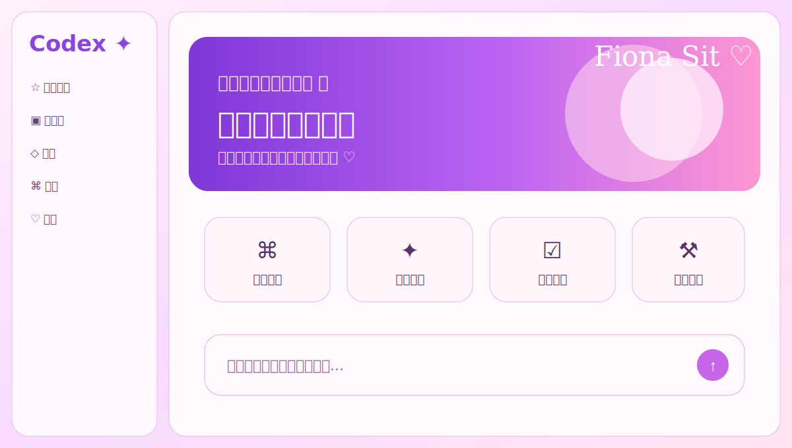

# Codex Skin

[English](README.en.md)

这是一个给 Codex 桌面版换皮肤的 Skill。它可以应用现成皮肤，也可以根据图片、配色或文字描述做新的皮肤包。

它的实现方式比较克制：通过本机的 Chromium DevTools Protocol 给 Codex 渲染层加样式，不改官方应用包，不替换可执行文件，也不动 `app.asar`。

本项目使用 Apache-2.0 许可。后续开源时保留 `LICENSE` 和 `NOTICE` 文件。

## 能做什么

- 给 Codex 应用内置皮肤。
- 按图片、风格描述或配色创建新皮肤。
- 导出 `.codex-theme` 主题包。
- 截图验证当前皮肤是否生效。
- 一键移除皮肤，恢复 Codex 原生界面。

当前内置皮肤：

- `dream`
- `kun-stage`
- `dilraba-rose`

## 主题效果

| 主题 | 预览 |
| --- | --- |
| `dream` |  |
| `kun-stage` |  |
| `dilraba-rose` |  |

## 环境要求

- 官方 Codex 桌面应用
- macOS 12+ 或 Windows 10/11
- Node.js 20+
- 本机 CDP 端口，只绑定 `127.0.0.1`

## 作为 Skill 使用

把本目录复制到 Codex 的 skills 目录：

```bash
mkdir -p ~/.codex/skills
cp -R /path/to/codex-skin ~/.codex/skills/codex-skin
```

然后在 Codex 里直接说：

```text
Use $codex-skin 给 Codex 应用 dream 皮肤。
```

也可以说：

```text
Use $codex-skin 根据这张图做一个新的 Codex 皮肤。
Use $codex-skin 关闭皮肤，恢复原生界面。
```

## 使用皮肤

最省事的方式是执行一次 `setup-skin`。它会安装皮肤配置，并在桌面生成启动、重启、恢复三个入口。

macOS：

```bash
cd /path/to/codex-skin
scripts/setup-skin.sh --theme dream
```

Windows：

```powershell
cd C:\path\to\codex-skin
scripts\setup-skin.ps1 -Theme dream
```

执行完成后，桌面会出现：

- `Codex Skin.command`：启动带皮肤的 Codex。
- `Codex Skin - Restart.command`：关闭当前 Codex，再用皮肤模式打开。
- `Codex Skin - Restore.command`：移除当前皮肤。

如果 Codex 正在运行，保存好当前工作后，双击 `Codex Skin - Restart.command`。之后日常使用时，双击 `Codex Skin.command` 即可。

也可以不用桌面入口，直接运行：

```bash
scripts/restart-skin.sh --theme dream
```

换皮肤只需要把主题名换掉：

```bash
scripts/install-skin.sh --theme kun-stage
scripts/restart-skin.sh --theme kun-stage
```

当前内置主题名：

- `dream`
- `kun-stage`
- `dilraba-rose`

## 移除皮肤

如果只是想关闭当前运行中的皮肤注入，使用：

```bash
scripts/restore-skin.sh
```

这会停止皮肤注入并尝试清理当前 Codex 窗口里的装饰层，不会删除聊天、任务、登录状态。

如果想恢复得更干净，删除桌面快捷方式，并恢复安装前保存的基础主题配置：

```bash
scripts/restore-skin.sh --uninstall --restore-base-theme
```

Windows：

```powershell
scripts\restore-skin.ps1
scripts\restore-skin.ps1 -Uninstall -RestoreBaseTheme
```

如果恢复脚本提示没有备份，说明当前机器上没有找到安装前保存的基础主题配置。这种情况下可以先运行不带 `--restore-base-theme` 的恢复命令，只移除运行中的皮肤。

## 手动命令

如果不想生成桌面入口，可以手动安装和启动：

```bash
scripts/install-skin.sh --theme dream
scripts/start-skin.sh --theme dream
```

如果 Codex 已经打开，而且不是通过皮肤脚本启动的：

```bash
scripts/start-skin.sh --theme dream --restart-existing
```

## 做一个新皮肤

先生成主题骨架：

```bash
node scripts/create-theme.mjs --id ocean-calm --name "Ocean Calm" --art /absolute/cover.png
```

主要改这两个文件：

- `themes/ocean-calm.json`
- `themes/ocean-calm.css`

应用并验证：

```bash
scripts/install-skin.sh --theme ocean-calm
scripts/start-skin.sh --theme ocean-calm
scripts/verify-skin.sh --theme ocean-calm --screenshot /absolute/ocean-calm.png
```

导出主题包：

```bash
node scripts/export-theme.mjs --theme ocean-calm --output /absolute/ocean-calm.codex-theme
```

## 开发

运行自测：

```bash
npm test
```

检查 npm 包内容：

```bash
npm run pack:check
```

## 安全边界

- CDP 只绑定到 `127.0.0.1`。
- 不要让多个皮肤控制器抢同一个端口。
- `.codex-theme` 当作不可信输入处理。
- 不要修改 `WindowsApps`、`/Applications/ChatGPT.app` 或 `app.asar`。

Codex 和 OpenAI 是各自所有者的商标。本项目是独立项目，不代表 OpenAI 官方。
